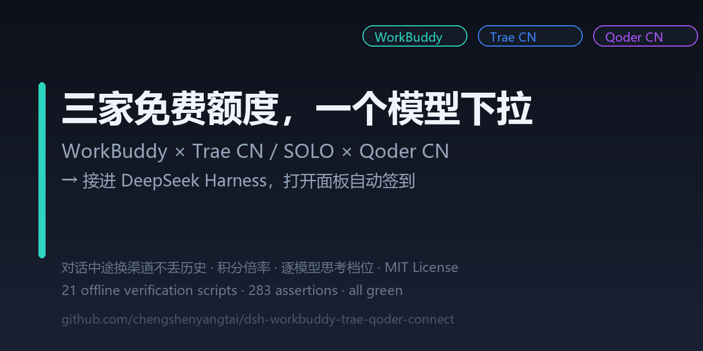

# dsh-workbuddy-trae-qoder-connect



**你已经付了三家 AI 订阅的钱。为什么还要在三个窗口、三个插件、三套历史之间来回切？**

这一个插件，把 **WorkBuddy（个人版多账号 / 企业版）· Qoder CN · Trae CN（IDE 版 / TRAE SOLO CN）**
全部接进 DeepSeek Harness —— 一个模型下拉、一套对话历史、一个状态面板。
**对话中途换渠道换模型，历史不丢。**

[](LICENSE)

> **English** — One DSH plugin that aggregates WorkBuddy (multi-account + enterprise),
> Qoder CN and Trae CN / TRAE SOLO CN into a single model picker with one shared
> conversation history. Switch channels mid-conversation without losing context,
> with live credit multipliers, per-model reasoning effort, daily check-in and image input.

---

## 你为什么想要它

同类的渠道插件基本都是**单渠道**：接 WorkBuddy 的、接 Trae 的、接 Qoder 的各一个包。
于是你装三份、开三个面板、维护三套凭据 —— 而它们本该是同一个东西。

| | 单渠道插件 ×3 | **本插件** |
|---|---|---|
| 模型下拉 | 三块，各管各的 | **一个列表**，按渠道分组 |
| 换模型 | 换插件 / 重开会话 | **对话中途直接换**，历史不丢 |
| 看状态 | 三个面板分别看 | 一个渠道中心看全部 |
| 每日签到 | 点三次 | **一次全领**（幂等） |
| 装几个包 | 三个 | **一个** |

三家协议完全不同（OpenAI 方言 / 私有 agent 协议 / 带自定义编码的双层 SSE），
插件在中间当翻译 —— 对 DSH 和你来说，它们长得一样。

## 核心能力

### 聚合

- **🔀 三家订阅，一个列表** —— 汇成单个模型下拉，按渠道分组，每个模型旁标注**积分倍率**，贵不贵一眼可见
- **🔁 会话内换模型** —— 中途从 WorkBuddy 换到 Qoder 再换到 Trae，历史不丢
- **➕ 渠道增删改名** —— 注册表里加槽位、就地改名、删除（凭据文件一并清理）
- **🎛️ 模型只留常用的** —— 渠道行点「已选 X / 共 N」勾选，改完立刻生效、不用重启

### 思考强度（reasoning effort）

- **🧠 逐模型的档位** —— 按每个模型**真实声明**的档位给选项（轻/中/高/极高），不是一刀切
- **⚡ 跟目录一起刷新** —— 点「更新模型」时档位**连同模型目录一起重取**，上游加档/收档立即反映，并在气泡里告诉你「N 个模型的思考档位已更新」
- **🎯 新会话用上游默认档** —— 未手动选档时，用该模型目录声明的默认档（如 `dmodel` 默认 `max`、`qmodel_38max` 默认 `medium`），而不是想当然的固定值
- **🔬 没声明就实测** —— 上游不声明档位的模型（如 `glm-5.3`、`hy3`），一键**探查**实测出来，结果缓存
- **🛡️ 不给必然报错的选项** —— `off` 一律不提供（实测两家上游都对它返回 400）；关思考走另一条已验证的路径（Qoder 用 id 后缀 `@nothink`）

### 干活

- **🛠️ Agent 工具调用** —— 能真正"干活"而不只是聊天：读文件、跑命令、改代码。Trae 已端到端实测（真实上游返回结构化工具调用、参数分片正确拼接、`finish_reason` 正确改写）
- **🖼️ 读图** —— 接通 DSH 附件服务，按各模型的上游标注开放
- **📏 百万级上下文** —— 主力模型普遍支持 1M 上下文，长会话不被 200k 截断

### 运维

- **📅 打开面板自动签到** —— 各渠道每日积分一次领完，幂等，可关
- **🔄 每个渠道独立「更新模型」** —— 重抓该渠道最新目录；Trae 会**现场跑导出脚本**从桌面端重新导出
- **🧩 Trae 两个产品都支持** —— Trae CN 与 TRAE SOLO CN 一条命令互切，凭据独立、目录分存
- **👁️ 隐藏渠道** —— 停用的模型不可见、不参与签到，凭据保留，随时能开回来

## 支持哪些渠道

| 渠道 | 能接入什么 | 登录方式 |
|---|---|---|
| **WorkBuddy** | 个人版多账号（槽位数不限）+ 企业版 | AI 工作流 / 脚本生成登录链接，浏览器点开登录 |
| **Qoder CN** | 官方 PAT，或直接用桌面 App 的登录态 | 二选一 |
| **Trae CN / TRAE SOLO CN** | 两个产品各自的全部模型 | 本机客户端凭据导出 |

**Trae CN 模型最全**，独占 `glm-5.3-flash` / `glm-5.3-flashx` / `kimi-k2.8-preview` / `qwen3.8-flash` 等；
TRAE SOLO CN 有自己的 8 个（`glm-5` / `kimi-k2.5` / `qwen-3.5` / 非正式版 `DeepSeek-V4` 等）。
两个产品**协议同构**，同一套代码用一张变体表支持，**没有分叉代码**。

```bash
node scripts/export-trae-plain.mjs --app cn     # 接 Trae CN（IDE）
node scripts/export-trae-plain.mjs --app solo   # 接 TRAE SOLO CN
node scripts/export-trae-plain.mjs --list       # 看两个产品各自的登录态
```

切换就是重跑一次导出，插件 30 秒内自动换线，**不用重启**。

## 安装

**前置**：DSH 桌面版、Node ≥ 20。

在 DSH 的插件页**粘贴仓库地址**即可安装（或在插件市场中搜索本插件）：

```
https://github.com/chengshenyangtai/dsh-workbuddy-trae-qoder-connect
```

装完**重启一次 DSH**，再配凭据。

## 让 AI 帮你启动

复制这段给 AI：

```text
跑 scripts/ 下的脚本配好 dsh-workbuddy-trae-qoder-connect 三个渠道的凭据，
WorkBuddy 登录要轮询到成功为止。完成后汇报各渠道状态与模型数，提醒我重启 DSH。
```

| 渠道 | 跑什么 |
|---|---|
| **Trae** | `node scripts/export-trae-plain.mjs`（`--app cn\|solo` 选产品，`--list` 看登录态） |
| **WorkBuddy** | `node scripts/workbuddy-login.mjs workbuddy1`（加账号换成 `workbuddy2` / `workbuddy3`…） |
| **Qoder** | 用桌面 App 登录态；没有才要 PAT，写到 `$DSH_HOME/qoder/pat` |

WorkBuddy 登录要点：**必须轮询到成功**。授权链接只是入口，凭据在 `login/poll` 拿到
`ready` 时才落盘；`state` 是进程内存（TTL 15 分钟），拿完链接就退出 = 这场授权作废。
所以要么跑不带 `--url-only` 的版本，要么取链接后持续轮询。

新增的渠道槽位（如 `workbuddy3`）重启 DSH 后才会装载；面板内不放扫码入口，因为
DSH 宿主点外部链接会把面板顶掉。

## 面板能做什么

渠道中心 → 设置页：

- **自动签到**（默认开）
- **隐藏 / 停用渠道** —— 停用的模型不可见、不参与签到，凭据保留
- **模型勾选** —— 渠道行点「已选 X / 共 N」，勾上即出现，**改完立刻生效**
- **推理档位检测** —— 对上游没声明档位的模型一键实测（消耗少量额度，结果缓存）
- **侧栏入口开关**

## 思考档位：声明与实测取并集

各模型可用的档位来自两处，**取并集**（谁也不压谁）：

1. **上游声明**（自动）—— 目录声明了哪些就显示哪些，是保底
2. **档位探查**（手动点）—— 没声明的模型点「检测」实测出来，是扩展

探查用**哨兵拒绝法**，三步顺序有意义，不是优化：
**基线**（证明凭据/请求形状本身可用，否则后续拒绝无法归因）→
**哨兵**（随机值，回答"上游到底校不校验这个字段"）→
**逐档扫描**（只在确证"会拒绝"之后才做）。

所以它不会把"传什么都收"误判成"支持所有档位"，也不会白烧额度 ——
实测 `qfmodel` 只用 2 个请求就得出「不校验」的结论，没有继续扫。

各家情况不同（**都是实测，别按渠道名想当然**）：

| 渠道 | 档位的真值来源 | 需要手动检测吗 |
|---|---|---|
| **Trae** | 目录按 (模型 × function) **精确声明** | 不需要 |
| **WorkBuddy** | 一部分有声明，其余需实测 | 需要 |
| **Qoder** | `thinking_config` 部分声明 + 探查兜底 | 需要 |

⚠️ 一个反复踩到的坑：**「是否支持档位」不能看「是否专用思考模型」**。
Qoder 的 `dfmodel`（DeepSeek-Flash）标 `is_reasoning: false` 却声明了 3 个档位 ——
那个布尔说的是"是否**专用**思考模型"，不是"能否调档"。
真正的档位声明在 `thinking_config.enabled.efforts` 里，**逐模型不同**。

## 目录与凭据怎么更新

| 渠道 | 模型目录 | 凭据 |
|---|---|---|
| **Qoder** | **实时从上游拉取** | PAT 或 App 会话，自动刷新 |
| **WorkBuddy** | **实时从上游拉取** | 登录链接写入，30 秒巡检 |
| **Trae** | **本机快照**：脚本从客户端解密导出 | 同左（重跑导出即换产品/续期） |

Trae 之所以特殊：凭据在客户端的加密存储里，且目录接口要三个特定请求头才回全量数据
（少一个会**静默降级**成不含 function 配置的空壳）。所以走"导出一次 → 本地读"，
重跑一次脚本就刷新；其余两家都是直接取上游。

## 边界（诚实说明）

- **Trae 国际版（trae.ai）未实现** —— 需要另一套网关与订阅状态接口
- **面板内不能点外部链接**（DSH 宿主会把面板顶掉）—— WorkBuddy 授权链接请复制到浏览器，或走命令行脚本
- **插件代码改动需重启 DSH** —— 只有凭据/产品切换是 30 秒内热生效
- **宿主升级后留意版本门禁** —— `peerDependencies` 需覆盖宿主的 `@deepseek-ai/dsh-*` 版本，否则插件会被整拒（表现为插件从管理页消失）。设置页插槽新旧两代（`settings.plugin.item` / 0.2+ 的 `settings.plugins.tab`）都注册了，宿主换代自动择路
- **部分模型的档位需要你手点一次检测** —— 上游不声明就无法自动得知（会消耗少量额度）
- 少数模型不是 1M 上下文（如 `kimi-k2.6`、`minimax-m2.7` 等较老的条目），以模型选择器里显示的为准
- 倍率数据从上游注册表拉取，`functions` 数量多时上游响应会变慢，所以分批查询；单批失败只影响那批模型的倍率显示
- **三个渠道不走插件级配置** —— `gateway`、`appId`、`pollIntervalMs` 之类的键一律用内置默认（它们是从上游收编时的遗留面，2026-10-08 已从 schema 撤下并写明缘由）。真正可调的只有本设置页里的项目；Qoder 的 PAT 另有环境变量通道（`QODERCN_PAT` 等）。

## 质量

自带 **20 个确定性验证脚本（257 项断言）**，不依赖网络、任何机器都能跑，当前**全绿**；
另有 2 个活体脚本做真实请求单点实测。每条探针都对应一个真实修过的 bug，
**且都做过反向验证**（把修复删掉，探针必须变红）：

```bash
node probes/verify-trae-products.mjs                 # Trae 双产品变体（40）
node probes/verify-probe-service.mjs                 # 哨兵探查服务（25）
node probes/verify-trae-effort-chain.mjs             # Trae 档位链路离线验证（22）
node probes/verify-qoder-effort-source.mjs           # Qoder 档位来源合并（21）
node probes/verify-effort-refresh.mjs                # 更新模型的档位差异 + 默认档 + 兜底名单（17）
node probes/verify-trae-tool-calling.mjs             # Trae 工具调用全链路（19）
node probes/verify-trae-output-hygiene.mjs           # Trae 输出净化 / 断流可见性 / parser 交接（17）
node probes/verify-probe-contract.mjs                # 探查契约与 onProbed 接线（17）
node probes/verify-qoder-auth-retry.mjs             # Qoder 凭据重试（11）
node probes/verify-trae-parser-handoff.mjs          # SSE 残片与收尾（11）
node probes/verify-qoder-stream-fixes.mjs            # Qoder 首事件批 / 返回形状 / 取消接线（9）
node probes/verify-workbuddy-tool-pairing.mjs        # 工具破损修复（9）
node probes/verify-attachment-wiring.mjs             # 三家附件接线（9）
node probes/verify-channel-disable-memory.mjs        # 禁用/启用渠道不丢模型勾选（8）
node probes/verify-probe-account-wiring.mjs          # 探查账号接线（8）
node probes/verify-qoder-error-classification.mjs    # 额度错误不再冒充"API 密钥无效"（8）
node probes/verify-provider-config-schema.mjs        # provider 配置 schema（7）
node probes/verify-schemastery-field-shapes.mjs        # 宿主 schema 调用形状（7）
node probes/verify-shim-cancel-wiring.mjs              # Qoder 499 取消根因回归（5）
node probes/verify-workbuddy-reasoning-levels.mjs       # 档位映射（off 恒为 null）（4）
```

探针纪律：断言拿**真实宿主 peer 包**跑，契约错误不能被沙箱 stub 吞掉；断言**值**而非键名；异步用例 await 且串行（共享全局 `fetch` 的用例并发会互相串味）；接线类修复走完整链路端到端测 —— 单组件单测是"永远绿"的。

## 项目结构

```
lib/providers/{workbuddy,trae,qoder}/   三渠道（各自注册 provider + 回环 shim + 路由）
lib/shared/probe.js                     渠道无关的档位探查（哨兵拒绝法）
lib/shared/catalog-diff.js              「更新模型」的模型 + 档位差异计算
lib/panel.js · lib/client.js            统一面板：状态 / 签到 / 设置 / 模型勾选
scripts/                                Trae 凭据导出 · WorkBuddy 登录链接 · Trae 解密
probes/                                 22 个脚本：20 确定性 + 2 活体
docs/                                   目录字段手册 · Trae 双产品接入 · 档位协议实证
```

## 说明

- 凭据与 token 由 `.gitignore` 排除，**仓库不含任何账号数据**
- 基于 [yembors64632/dsh-connect](https://github.com/yembors64632/dsh-connect)，MIT 许可证；上游致谢见 [NOTICE](NOTICE)
- 设计细节：[docs/CATALOG.md](docs/CATALOG.md) · [docs/TRAE-CN-PRODUCTS.md](docs/TRAE-CN-PRODUCTS.md) · [docs/TRAE-REASONING-EFFORT.md](docs/TRAE-REASONING-EFFORT.md)

## License

[MIT](LICENSE)
